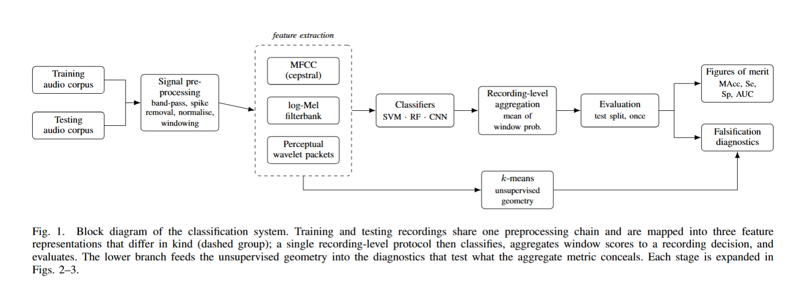

# Interpretable Phonocardiogram Classification

Code for the Audio Pattern Recognition course project *Interpretable
Phonocardiogram Classification*. Binary Normal/Abnormal classification of heart
sound recordings from the PhysioNet/CinC Challenge 2016 corpus, comparing three
feature representations and three classifier families under one recording-level
protocol, with every performance claim paired with a diagnostic that could
refute it.

**Report:** [`report.pdf`](./report.pdf) (IEEE conference format).

> **Abstract.** Three feature representations, cepstral
> (MFCC), spectral (log-Mel) and perceptual wavelet packet (PWP), are compared
> across SVM, random forest and CNN classifiers. The best configuration reaches
> a modified accuracy (MAcc) of 0.866, comparable to published entries. The
> contribution is not that number: unsupervised clustering, a per-site
> breakdown, attribution timing and a site-classifier experiment together show
> that the aggregate metric substantially overstates what the models have
> learned, because recording-site prevalence, not cardiac acoustics, carries
> most of the pooled score.



---

## Requirements

- Python >= 3.10
- ~8 GB RAM; a CUDA GPU is optional (reduces CNN training from ~1 h to minutes)
- ~6 GB disk for the corpus and intermediates
- LaTeX with `IEEEtran.cls`/`IEEEtran.bst` to build the report

Install dependencies:

```bash
git clone <repository-url>
cd apr-heart-sounds
pip install -r requirements.txt
```

Tested with Python 3.11, numpy 2.4, scipy 1.17, scikit-learn 1.9, librosa 0.11,
PyWavelets 1.8, torch 2.4 (CUDA 12.4), shap 0.51. Corpus download uses `wfdb`.

## Data

PhysioNet/CinC Challenge 2016 — 3,240 recordings, 20.2 h, 2 kHz, six
sub-databases, 20.5 % abnormal, ODC-BY 1.0 licence. **The corpus is not
redistributed here;** it is fetched by the first pipeline phase:

```bash
python scripts/00_download_data.py        # or: make data
```

The official challenge test set was never released publicly, so all results use
a self-defined split of the public training data (484 test recordings);
comparison with published entries is contextual, not like-for-like.

## Training

The whole pipeline runs end to end (~2 h on CPU, dominated by feature extraction
and CNN training):

```bash
bash scripts/run_all.sh
```

Phases are individually runnable and resumable, since each reads and writes
artifacts on disk:

```bash
make preprocess features            # 01-02: filter, window, extract MFCC/log-Mel/PWP
make classical cnn                  # 04-05: train SVM + RF (grouped CV) and the CNN
bash scripts/run_all.sh --from 04   # resume from any phase
```

Hyperparameters, augmentation and thresholds are selected by grouped
cross-validation on the training/validation splits only; all settings live in
[`configs/config.yaml`](configs/config.yaml).

## Evaluation

The test split is opened by exactly one phase (06), which produces the main
results table. Phase 11 is a standalone confirming experiment that reads the
training split only.

```bash
make evaluate                       # 06: figures of merit on the test split
python scripts/11_site_shortcut.py  # 11: site classifier + leave-one-site-out
```

Explainability and unsupervised diagnostics:

```bash
make cluster                        # 03: k-means + PCA/t-SNE
make shap gradcam alignment         # 07-09: SHAP, Grad-CAM, cardiac-cycle enrichment
```

## Pre-trained models

None are shipped: models are inexpensive to retrain, and `run_all.sh`
regenerates every artifact deterministically (one fixed seed). Each phase writes
its outputs and a machine-readable summary to `reports/phase_*/summary.{md,json}`,
including which data splits it read — so the "only phase 06 opens the test split"
guarantee is a checkable field, not a promise.

## Results

Best configurations, recording-level, on the self-defined test split
(reproduce with `make evaluate`):

| Model | Acc. | Se. | Sp. | MAcc | 95 % CI | AUC |
|---|---|---|---|---|---|---|
| SVM-MFCC | 0.816 | 0.949 | 0.782 | **0.866** | [0.834, 0.894] | 0.922 |
| CNN-log-Mel | 0.851 | 0.889 | 0.842 | 0.865 | [0.828, 0.900] | **0.961** |
| RF-MFCC | 0.802 | 0.949 | 0.764 | 0.857 | [0.824, 0.886] | 0.906 |
| SVM-PWP | 0.785 | 0.909 | 0.753 | 0.831 | [0.794, 0.863] | 0.877 |
| RF-PWP | 0.731 | 0.970 | 0.670 | 0.820 | [0.790, 0.847] | 0.864 |

All intervals overlap; a constant *Normal* predictor scores 0.795 accuracy at
0.500 MAcc, which is why MAcc, not accuracy, is the primary metric.

**Diagnostics.** Each is designed to be able to refute a performance claim, and
is reported in the same voice whether it held or not.

| Diagnostic | Command | Result |
|---|---|---|
| Unsupervised structure | `make cluster` | k-means recovers the **site** (ARI 0.201) far better than the **diagnosis** (ARI 0.018) |
| Per-site performance | `make evaluate` | MAcc spans **0.986 -> 0.477**; three of five sites at/below a constant predictor |
| Attribution timing | `make gradcam alignment` | systolic enrichment 1.056, no higher on correct (1.085) than on false-alarm (1.115) predictions |
| Site shortcut | `python scripts/11_site_shortcut.py` | site recoverable at **0.87** recording accuracy; diagnosis MAcc **0.84 -> 0.46** under leave-one-site-out |

Abnormal prevalence varies across the six sites by 68.9 pp, so site identity
alone predicts the label; the pooled metric is carried by `training-e` (66 % of
test recordings at 8.7 % prevalence). The site-shortcut experiment confirms the
mechanism directly, with the qualification that a weak diagnosis signal survives
once site is held fixed (within-site MAcc 0.55-0.64 on the large sites).

**Pre-registered claims** — thresholds fixed in code, scored by the pipeline:

| # | Claim | Verdict | Scored in |
|---|---|---|---|
| C1 | Class structure is recoverable without labels | contradicted | phase 03 |
| C2 | The CNN outperforms the best classical pairing | contradicted | phase 06 |
| C3 | All models exceed trivial baselines | supported | phase 06 |
| C4 | Frequency attribution agrees across feature domains | weak | phase 07 |
| C5 | Attribution concentrates in systole | weak | phase 09 |
| C6 | Performance is a site-prevalence shortcut | supported | phase 11 |

## Repository layout

```
configs/          config.yaml (all settings; SHA-256 hashed per run)
src/              library code, no side effects at import
  config/  data/  features/  models/  clustering/  evaluation/  xai/  visualization/
scripts/          00-11 phase orchestrators + run_all.sh
figures/          generated figures
reports/          per-phase summaries + PIPELINE_STATUS.md
paper/            IEEE report: main.tex, sections/, tables/, figs/, refs.bib
requirements.txt
```

Pipeline phases: `00` download, `01` preprocess, `02` features, `03` cluster,
`04` classical, `05` CNN, `06` evaluate (opens test), `07` SHAP, `08` Grad-CAM,
`09` cycle alignment, `10` report assets, `11` site-shortcut confirming test.

## Reproducibility

- One seed propagated to `random`, `numpy`, `torch` and all scikit-learn estimators.
- `configs/config.yaml` is SHA-256 hashed and the hash recorded in every phase summary.
- Environment (Python, package versions, git commit, GPU) captured per phase.
- All report tables are generated from result JSON and `\input{}` directly, so no
  number in the paper is retyped by hand.

## Attribution

Course project by Ilyass Ouardi, Audio Pattern Recognition,
Università degli Studi di Milano (2026). Feel free to reuse under the MIT
licence; a link back is appreciated.

## License

Code released under the [MIT License](LICENSE). The PhysioNet/CinC 2016 corpus
is distributed separately under ODC-BY 1.0 and is not included in this
repository.

## References

- Liu, C. et al. (2016). An open access database for the evaluation of heart
  sound algorithms. *Physiological Measurement*, 37(12), 2181-2213.
- Clifford, G. D. et al. (2016). Classification of normal/abnormal heart sound
  recordings: the PhysioNet/Computing in Cardiology Challenge 2016. *Computing
  in Cardiology*, 43, 609-612.